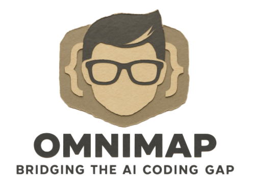

[English](./README.md) | [Türkçe](./README.tr.md) | [한국어](./README.ko.md) | [日本語](./README.ja.md) | [中文](./README.zh.md) | [தமிழ்](./README.ta.md)

> このドキュメントは英語のREADMEから翻訳されたものです。一部の表現が不自然な場合があります。

<p align="center">
  
</p>

<h1 align="center">OmniMap</h1>

<p align="center">
  <a href="https://www.npmjs.com/package/@rsrini/omnimap"></a>
  <a href="./LICENSE"></a>
</p>

<p align="center">
  AIは数秒でコードを書きます。人間が理解するには数時間かかります。<br/>
  理解をスキップすると、コードベースはブラックボックスになります — あなた自身にとっても。<br/><br/>
  <strong>ommがそのギャップを埋めます — AIが生成した、人間のためのアーキテクチャドキュメント。</strong>
</p>

---

## クイックスタート

ターミナルに貼り付けてください：

```bash
npm install -g @rsrini/omnimap && omm setup
```

AIコーディングツールを開き、`/omm-scan`スキルを実行：

```
/omm-scan
```

以上です。結果を表示：

```bash
omm view
```

## 例

> ommが自分自身をスキャンしました。これがその結果です。

<table><tr>
<td width="50%"></td>
<td width="50%"></td>
</tr></table>

## 仕組み

AIがコードベースを分析し、**パースペクティブ**を生成します — アーキテクチャを見るための様々なレンズ（構造、データフロー、外部連携など）。各パースペクティブにはMermaidダイアグラムとドキュメントフィールドが含まれます。

すべてのノードが**再帰的に分析**されます。複雑なノードは独自のダイアグラムを持つネストされた子エレメントになります。シンプルなノードはリーフとして残ります。ファイルシステムがツリーを直接反映します：

```
.omm/
├── overall-architecture/           ← パースペクティブ
│   ├── description.md
│   ├── diagram.mmd
│   ├── context.md
│   ├── main-process/               ← ネストされたエレメント
│   │   ├── description.md
│   │   ├── diagram.mmd
│   │   └── auth-service/           ← より深いネスト
│   │       └── ...
│   └── renderer/
│       └── ...
├── data-flow/
└── external-integrations/
```

ビューアはファイルシステムからネストを自動検出します — 子を持つエレメントは展開可能なグループとして、それ以外はノードとしてレンダリングされます。

各エレメントは最大7つのフィールドを持ちます：`description`、`diagram`、`context`、`constraint`、`concern`、`todo`、`note`。

## CLI

```bash
omm setup                          # AIツールにスキルを登録
omm view                           # インタラクティブビューアを開く
omm config language ja             # コンテンツ言語を設定
omm format <element>               # Show diagram format (mermaid/plantuml)
omm config plantuml-status         # Check PlantUML status
omm incremental                    # git diff に基づく増分再スキャンを計画
                                   # stale理由: source_file, source_glob, orphaned_source,
                                   #   glob_coverage_changed, no_source_tracking
omm update                         # 最新バージョンに更新
omm analyze [--format md|json]     # tree-sitterによる構造解析（依存グラフ、API、モジュール）
omm analyze --validate             # 文書化されたアーキテクチャ vs 実際のコード構造を比較
omm analyze --impact <file>        # ファイル変更時の影響範囲を分析
omm search <query>                 # 要素名/説明/パスのあいまい検索
omm sync [--search <query>]        # .omm/をSQLiteに同期（FTS5検索）
omm tour [dir] [--limit n]         # 依存順序ベースのガイドツアー
omm wiki                           # クロール可能なマークダウンwikiを生成（デフォルト: .omm/.wiki/）
omm affected [files...] [--staged] # 変更の影響を受けるテストファイルを検索
omm mcp [--port <port>]            # AIエージェント用MCPサーバー起動
omm watch [dir]                    # ファイル変更時にomm analyzeを自動実行
omm merge <source>                 # 別の .omm/ を現在にマージ
omm view --share                   # ネットワーク共有ビューアを開く
omm treecode                       # ソースコード ↔ .omm/ カバレッジマップ
omm signature --check              # 構造シグネチャのドリフト検出
omm reconcile                      # .omm/とソースコードの同期
omm links <element>                # 外部ドキュメントリンク管理
omm inspect <element>              # 詳細要素検査
```

完全なコマンドリストは`omm help`を参照してください。

## スキル

スキルは**AIコーディングツール内で**実行するコマンドです（ターミナルではありません）。`/`で始まります。

| スキル | 機能 |
| --- | --- |
| `/omm-scan` | コードベース分析 → アーキテクチャドキュメント生成 |
| `/omm-push` | ログイン + リンク + クラウドプッシュを一度に |

## クラウド

[ohmymermaid.com](https://ohmymermaid.com)を通じてアーキテクチャをクラウドに保存できます。

```bash
omm login && omm link && omm push
```

デフォルトではプライベートです。チームと共有したり、[この例](https://ohmymermaid.com/share/c47e20a7063c231760361ed9cb9ec4b6)のように公開できます。

## プロジェクトピッカー

`omm view` をアーキテクチャリポジトリで実行すると、プロジェクトを選択するためのピッカーページが自動的に表示されます。複数プロジェクトがある際に、視覚的に目的の課題を選択できます。

| 表示情報 | 説明 |
| --- | --- |
| **Perspectives数** | プロジェクトに含まれるパースペクティブ（最上位ディレクトリ）の数 |
| **Elements数** | 再帰的にカウントしたすべてのエレメント（ディレクトリ）の合計 |
| **最終更新** | いずれかのエレメントの `meta.updated` の最新日時 |

複数の組織（arch repo）を設定している場合は、画面上部の組織スイッチャーで切り替えながらプロジェクトを選択できます。

## 対応AIツール

| プラットフォーム | セットアップ |
| --- | --- |
| Claude Code | `omm setup claude` |
| Codex | `omm setup codex` |
| Cursor | `omm setup cursor` |
| OpenClaw | `omm setup openclaw` |
| Antigravity | `omm setup antigravity` |
| OpenCode | `omm setup opencode` |
| pi (pi.dev) | `omm setup pi` |
| Oh my Pi (omp) | `omm setup omp` |

`omm setup`を実行すると、インストール済みのすべてのツールを自動検出して設定します。

## ロードマップ

[docs/ROADMAP.md](./docs/ROADMAP.md)を参照してください。

## 開発 & 貢献

```bash
git clone https://github.com/@rsrini/omnimap.git
cd omnimap
npm install && npm run build
npm test
```

IssueとPRを歓迎します。[Conventional Commits](https://www.conventionalcommits.org/)を使用してください。

## ライセンス

[MIT](./LICENSE)
