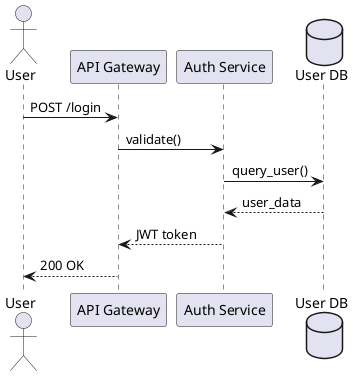

# PlantUML Setup Guide

OmniMap supports PlantUML diagrams (sequence, C4, class, state) alongside Mermaid.

## Rendering Options

Choose one option based on your environment:

### Option 1: Public Kroki API (Default)

**Zero setup** — works out of the box.

- Endpoint: `https://kroki.io`
- Free, no authentication required
- Supports PlantUML, Mermaid, D2, Graphviz, and more
- Rate-limited (fine for personal use)

No configuration needed. Just create `.puml` files and `omm view` will render them.

### Option 2: Self-Hosted Kroki (Docker)

**For corporate/team use** — no internet dependency, no rate limits.

```bash
# Simple single-container
docker run -d -p 8000:8000 --name kroki yuzutech/kroki

# Configure OmniMap
omm config kroki-url http://localhost:8000
```

**Full stack with Mermaid support:**

```bash
# Use the included docker-compose file
docker compose -f docker-compose.kroki.yml up -d

# Configure OmniMap
omm config kroki-url http://localhost:8000
```

### Option 3: Local PlantUML (Offline)

**For air-gapped environments** — native binary (no Java needed) or JAR.

```bash
# Auto-download native binary (~200ms render, 10x faster than JAR)
omm config plantuml-download

# Verify setup
omm config plantuml-status
```

**Supported platforms:**

| OS | Architecture | Binary |
|----|-------------|--------|
| macOS | ARM64 (M1/M2) | `native-plantuml-macos-arm64` |
| macOS | x86_64 (Intel) | `native-plantuml-macos-x86_64` |
| Linux | x86_64 | `native-plantuml-linux-amd64` |
| Linux | ARM64 | `native-plantuml-linux-arm64` |
| Windows | x86_64 | `native-plantuml-windows-amd64` |

**Manual download:**

1. Download from https://github.com/plantuml/plantuml/releases
2. Place binary at `~/.omnimap/plantuml` (or `plantuml.exe` on Windows)
3. Make executable: `chmod +x ~/.omnimap/plantuml`

## Configuration Commands

```bash
# Check PlantUML status (Java + JAR)
omm config plantuml-status

# Auto-download plantuml.jar
omm config plantuml-download

# Set Kroki endpoint
omm config kroki-url https://kroki.io           # Public (default)
omm config kroki-url http://localhost:8000      # Self-hosted

# Set custom plantuml.jar path
omm config plantuml-jar /opt/plantuml.jar
```

## Rendering Priority

```
1. Local plantuml.jar  (if configured & Java available)
       ↓
2. Kroki API          (default: https://kroki.io)
       ↓
3. Raw source fallback (shown as <pre> block)
```

## When to Use PlantUML

| Use Case | Recommended Format |
|----------|-------------------|
| Sequence diagrams (API flows, microservice interactions) | **PlantUML** |
| C4 architecture (system context, container diagrams) | **PlantUML** |
| Class diagrams (complex relationships) | **PlantUML** |
| State diagrams (concurrent states) | **PlantUML** |
| Simple architecture overviews | Mermaid |
| Dependency graphs | Mermaid |
| Flowcharts | Mermaid |

## PlantUML Diagram Examples

### Sequence Diagram



### C4 System Context

```plantuml
@startuml
!include https://raw.githubusercontent.com/plantuml-stdlib/C4/master/C4_Context.puml

Person(developer, "Developer", "Uses OmniMap")
System(omnimap, "OmniMap", "Architecture documentation")
System_Ext(github, "GitHub", "Code repository")

Rel(developer, omnimap, "Scans codebase")
Rel(omnimap, github, "Pushes docs")
@enduml
```

### Class Diagram

```plantuml
@startuml
class User {
  +id: int
  +name: string
  +login()
}

class Auth Service {
  +validate()
  +generateToken()
}

User --> Auth Service
@enduml
```

## Troubleshooting

### Java not found

```bash
# Check if Java is installed
java -version

# Install via sdkman (recommended)
sdk install java

# Or install via Homebrew (macOS)
brew install openjdk
```

### Kroki connection refused

```bash
# Check if Kroki is running
curl http://localhost:8000/health

# Restart Docker container
docker restart kroki
```

### plantuml.jar not rendering

```bash
# Verify JAR is valid
java -jar ~/.omnimap/plantuml.jar -version

# Re-download if corrupted
rm ~/.omnimap/plantuml.jar
omm config plantuml-download
```
