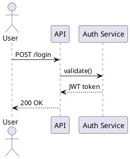

# omm-scan — Perspective-Based Architecture Scanner

## Purpose

Analyze the codebase and generate `.omm/` architecture documentation using **perspective-driven recursive analysis**.

- A **perspective** is a top-level element — a distinct way to look at the architecture.
- Each element in a diagram gets analyzed recursively. If it has internal structure, it becomes a **child element** (subdirectory with its own diagram). If not, it stays a leaf.
- The filesystem determines nesting. Element IDs in diagrams match child directory names. The viewer resolves groups from the filesystem.

## Prerequisites

```bash
command -v omm || npm install -g @rsrini/omnimap
```

If the install fails, tell the user: "Please run `npm install -g @rsrini/omnimap` in your terminal, then try again."

---

## Diagram Format Support

OmniMap supports two diagram formats:

| Format | Extension | Use Case |
|--------|-----------|----------|
| **Mermaid** | `.mmd` | Default. Architecture overviews, flowcharts, dependency graphs |
| **PlantUML** | `.puml` | Sequence diagrams, C4 architecture, class diagrams, state diagrams |

### When to use PlantUML

- **Sequence diagrams** — API flows, microservice interactions, authentication flows
- **C4 diagrams** — System context, container diagrams, enterprise architecture
- **Class diagrams** — When you need advanced stereotypes or complex relationships
- **State diagrams** — Concurrent states, nested states

### Format detection

OmniMap auto-detects format by file extension:
- `diagram.puml` or `diagram.plantuml` → PlantUML
- `diagram.mmd` → Mermaid (default)

### Setting format explicitly

```bash
# Check current format
omm format <element>

# Set format
omm format <element> set plantuml
omm format <element> set mermaid
```

### PlantUML diagram examples

**Sequence diagram:**


**C4 System Context:**
```plantuml
@startuml
!include https://raw.githubusercontent.com/plantuml-stdlib/C4/master/C4_Context.puml

Person(user, "User", "Uses the system")
System(app, "My App", "Main application")
System_Ext(ext, "External API", "Third party")

Rel(user, app, "Uses")
Rel(app, ext, "Calls")
@enduml
```

---

## Step 0: Check Language

```bash
omm config language
```

Write field content (description, context, constraint, concern, todo, note) in the configured language. Default is English. Element IDs, directory names, and diagram node IDs are always English kebab-case.

## Step 1: Explore the Codebase

Run the structural analyzer first to get deterministic code facts:

```bash
omm analyze --format md
```

This gives you a structured foundation:
- **Dependency graph** — what imports what, with resolved paths
- **Public API surface** — exported functions, classes, types
- **Module boundaries** — directory-level cohesion scores
- **Definitions** — all functions, classes, methods with line numbers
- **Architecture insights** — circular deps, god nodes, communities, coupling hotspots, dead exports, fitness score, complexity hotspots, layer classification, guided tour

Use the **fitness score** (0-100) to gauge architecture health. Use **circular deps** and **hotspots** to identify structural risks worth documenting as concerns.

Use this as the **deterministic anchor**. Then read key files for semantic context:
- Read `package.json`, `pyproject.toml`, or equivalent manifests
- Look for route definitions, service layers, database connections, external integrations
- Read business logic to understand constraints, concerns, and design rationale

If tree-sitter is not installed (`omm analyze` shows "parser not available"), fall back to
Glob and Read to understand the project structure manually.

## Step 1.5: Check existing coverage and drift

Before scanning, check the current state of the documentation:

```bash
# See which source files are covered by .omm/ elements
omm treecode --stats

# Check if .omm/ structure has drifted since last update
omm signature --check

# Full reconciliation report (orphaned sources, missing descriptions, broken refs)
omm reconcile
```

If `omm signature --check` fails, the .omm/ tree structure has changed (elements added/removed). Run `omm signature --update` after the scan to store the new signature.

If `omm reconcile` reports orphaned source files, run `omm reconcile --fix` to clean them up before scanning.

## Step 1.5: Plan an incremental update (when updating an existing scan)

If `.omm/` already exists, do not re-scan everything. Use `omm incremental` to find what changed:

```bash
# Plan — see which elements are stale, fresh, or unknown since the last scan.
omm incremental

# Machine-readable plan (for piping into other tools).
omm incremental --json
```

A clean plan output (no stale elements) means nothing needs re-analysis. For any
element listed as **Stale**, re-run Steps 3a–3c only for that element. For
**Unknown** elements (no source tracking), re-run Steps 3a–3c if the
perspective's code surface has changed.

When the scan agent finishes re-analyzing a perspective, it should record the
new baseline so the next `omm incremental` run diffs against the right commit:

```bash
# Record: this perspective was just fully (re-)analyzed.
omm incremental --record <perspective> full

# Record: this perspective was incrementally updated.
omm incremental --record <perspective> incremental
```

If the perspective's source surface is not yet tracked, bootstrap it:

```bash
# Tell omm which files / globs this perspective covers.
omm incremental --mark <perspective> --files <path>... --globs <glob>...

# Replace the tracked set instead of appending.
omm incremental --mark <perspective> --files <path>... --replace
```

From the catalog below, choose which perspectives are meaningful for this codebase.

### Perspective Catalog

| Perspective | When to create | What it answers |
| --- | --- | --- |
| `overall-architecture` | **Always** | What exists and how pieces relate |
| `request-lifecycle` | Any server/API | How a request enters and gets handled end-to-end |
| `data-flow` | Any data processing, DB usage | Where data comes from, transforms, and lands |
| `dependency-map` | Complex module graph | What depends on what, what's shared |
| `external-integrations` | External APIs/services | What the system connects to and why |
| `state-transitions` | Stateful features (frontend or backend) | How state changes and what triggers it |
| `route-page-map` | Frontend with routing | Page structure and navigation flow |
| `command-surface` | CLI tools | Command hierarchy and dispatch |
| `extension-points` | Plugin/extension systems | Extension architecture and registry |
| `pipeline` | ML/data pipelines | Stage topology and data flow |
| `orchestration` | Event-driven/queue systems | Publisher, subscriber, broker topology |
| `storage` | 2+ storage systems | Storage topology (DB, cache, queue, object store) |

Don't force perspectives that don't exist in the code.

## Step 3: Generate Perspectives with Recursive Drill-Down

For each selected perspective, follow this recursive process:

### 3a. Write the perspective diagram

Element IDs match child directory names. The viewer resolves nesting from the filesystem.

```bash
omm write <perspective> diagram - <<'MERMAID'
graph LR
    renderer["Renderer\nsrc/renderer/"]
    renderer -->|"IPC invoke/on"| main-process["Main Process\nsrc/main/"]
    main-process -->|"spawn PTY"| engine-system["Engine System\nsrc/main/engine/"]
    main-process -->|"read/write JSON"| data-store["Data Store\nsrc/main/store.ts"]
    main-process -->|"xterm.js"| terminal-dock["Terminal Dock\nsrc/renderer/src/panel/"]
MERMAID
```

### 3b. Write the other 6 fields

Each as a separate `omm write` command: description, context, constraint, concern, todo, note.

### 3c. Recursive drill-down: analyze every element

**For every element in the diagram:**

1. **Analyze** the code it represents (Glob + Read the relevant files/directories)

2. **Write description for every node — no exceptions.** This creates the element directory. Optionally write other fields (context, constraint, concern, todo, note) if relevant — Write in the configured language.

   ```bash
   omm write <perspective>/<element-name> description - <<'EOF'
   (what this element does, which files/dirs it covers)
   EOF
   ```

3. **Decide leaf or group:**
   - **Distinct internal components found** → write a diagram and recurse deeper (it becomes a group)
   - **No meaningful sub-components** (single file, trivial wrapper, external system) → write remaining fields only (it stays a leaf)

4. **If group** — write diagram and recurse:

   ```bash
   omm write <perspective>/<element-name> diagram - <<'MERMAID'
   graph LR
       (internal elements)
   MERMAID
   ```

   Then repeat step 3c for each element in this diagram.

5. **Document ALL diagram nodes — including leaf nodes.** Every node ID in a diagram should have a corresponding `.omm` element with at least a description. If a diagram contains `budget["Budget\nSessionBudgetTracker"]`, create:

   ```bash
   omm write <perspective>/budget description - <<'EOF'
   SessionBudgetTracker — enforces token and cost limits per agent session.
   EOF
   ```

   This ensures clicking any node in the viewer shows meaningful content, not just "this is a diagram node."

### Example recursion

```text
overall-architecture (perspective)
  elements: renderer, main-process, engine-system, data-store, terminal-dock

  → analyze renderer (src/renderer/)
    → finds: App.tsx, components/, hooks/, stores/, world/
    → group → write diagram with: components, stores, world
      → analyze components → 15 .tsx files, no sub-structure → leaf
      → analyze stores → 4 zustand stores → leaf
      → analyze world → OfficeCanvas + PixiJS logic → leaf

  → analyze main-process (src/main/)
    → finds: ipc.ts, auth/, engine/, terminal-session-service.ts, store.ts
    → group → write diagram with: auth, engine, terminal-session
      → analyze auth → auth-service.ts, callback-server.ts → leaf
      → analyze engine → claude-code.ts, codex.ts → leaf

  → analyze data-store (src/main/store.ts)
    → single file → leaf

  → analyze terminal-dock (src/renderer/src/panel/)
    → TerminalDock.tsx, DockManager → leaf
```

## Step 4: Generate Flows

After writing all fields for a perspective, generate **flow definitions** that trace meaningful paths through the diagram. Flows power the animated flow visualization in the viewer.

### How to identify flows

From the perspective's diagram:

1. **Find entry points** — nodes with no incoming edges (sources)
2. **Find terminal nodes** — nodes with no outgoing edges (sinks)
3. **Trace paths** from entry points to terminals
4. **Name each flow** based on what it represents (e.g., "Install", "Request Path", "Deploy Pipeline")

### Flow rules

- Every node should appear in at least one flow
- Every edge should appear in at least one flow
- Flows should be **meaningful** — trace a real user journey, request path, or process
- Use short, descriptive names (1-2 words)
- Include a description explaining what the flow represents

### Write flows

For each perspective, write flows using the CLI:

```bash
omm flows <perspective> add <FlowName> <<'EOF'
name: FlowName
description: What this flow traces
steps:
  - node: entry-node
  - edge: entry-node->next-node
  - node: next-node
  - edge: next-node->terminal-node
  - node: terminal-node
EOF
```

### Flow YAML format

```yaml
name: Install
description: Developer installs skills via CLI
steps:
  - node: user          # highlight this node
  - edge: user->cli     # highlight this edge
  - node: cli
  - edge: cli->output
  - node: output
```

- `node` steps reference node IDs from the diagram (the part before `[` in node definitions)
- `edge` steps reference `from->to` where from/to are node IDs
- Steps are ordered — they define the visual sequence

### Coverage target

Aim for 2-5 flows per perspective that collectively cover all nodes and edges. Each flow should tell a distinct story.

## Step 5: Auto-Improve Loop (Quality Gate)

After initial scan completes, **automatically invoke `/omm-eval`** to improve documentation until a target quality score is reached. This is a self-improving loop.

### How it works

1. **Run eval to get baseline** after initial scan
2. **If score < target** (default 80), improve based on issues
3. **Re-run eval** to verify improvement
4. **Repeat** until target reached or max iterations hit

```bash
# 1. Get baseline
BASELINE=$(omm eval --json)
SCORE=$(echo "$BASELINE" | jq -r '.summary.overallScore')
echo "Initial score: $SCORE"

# Or use --explain to deep-dive into specific elements
omm eval --explain overall-architecture

# Or use --suggest to see top improvement opportunities
omm eval --suggest

# 2. Loop until target or max iterations
TARGET=80
MAX_ITER=10
for i in $(seq 1 $MAX_ITER); do
  if [ "$SCORE" -ge "$TARGET" ]; then
    echo "✓ Target reached in iteration $((i-1))"
    break
  fi

  # Identify worst elements
  echo "--- Iteration $i (current score: $SCORE) ---"

  # For each worst element (score < target):
  # 1. Read existing fields
  # 2. Read source code
  # 3. Write missing fields with `omm write`
  # 4. Add missing flows with `omm flows`
  # 5. Add missing tags with `omm tag`

  # Re-run eval
  NEW_SCORE=$(omm eval --json | jq -r '.summary.overallScore')
  echo "  New score: $NEW_SCORE"

  if [ "$NEW_SCORE" -le "$SCORE" ]; then
    echo "  No improvement, stopping"
    break
  fi
  SCORE=$NEW_SCORE
done
```

### Iteration strategy (based on actual scoring formula)

**The scoring formula** (from `omm eval` source):

| Component | Max | Conditions |
|-----------|-----|-----------|
| Fields | 40 | proportional to fields filled (7 total) |
| Diagram | 20 | 20 if valid mermaid, 10 if has but invalid |
| Description | 10 | 10 if >50 chars, 5 if >20 chars |
| Flows | 10 | 10 if element has any flow definitions |
| Refs | 10 | 10 if element has any @cross-references |
| Children | 10 | 10 if no children OR all children covered |

**Iteration 1** — Fill sparse fields (biggest ROI: +40 pts possible):
- For each element with < 4 fields filled, read source code and write missing context, constraint, concern, todo, note
- Target: field coverage >= 60%

**Iteration 2** — Add diagrams to leaves (important: +20 pts each):
- Even leaves benefit from a tiny 2-3 node diagram. The `omm-scan` SKILL.md says leaves don't need diagrams, but **eval penalizes leaves without diagrams**. Add a small "input → this → output" diagram.
- Target: diagram coverage >= 80%

**Iteration 3** — Add flows to perspectives and large groups (+10 pts each):
- For each perspective or group with no flows, trace 2-3 paths and add them
- Target: flow coverage >= 50%

**Iteration 4** — Add @cross-references in diagrams (+10 pts each):
- **IMPORTANT**: Only add @references within the same perspective (parent → child, child → sibling)
- **DO NOT** add @references between different perspectives (e.g., command-surface → data-flow)
- Only the hub perspective (overall-architecture) should reference other perspectives
- For focused perspectives (command-surface, data-flow), use internal @refs only
- This also enables the relationship graph in the viewer
- Target: ref integrity >= 50%

**Circular Reference Prevention**:
- Before adding a @ref, check: "Does this create a loop? (A → B → A)"
- If perspective A references perspective B, perspective B should NOT reference perspective A
- Run `omm validate` after changes to check for `perspective-cross-ref` warnings

**Iteration 5** — Improve descriptions:
- For each element with description < 50 chars, expand it based on source code
- Target: avg description length >= 80 chars

**Iteration 6** — Add tags to all perspectives:
- For each perspective without tags, add 2-3 category tags (e.g., `core`, `infra`, `api`, `data`)
- Target: every perspective has >= 2 tags

**Iteration 7** — Document children:
- For each parent element with undocumented children, add child descriptions
- Target: children coverage = 100%

**Iteration 8** — Document diagram-only nodes:
- Check `omm eval` for `undocumented-diagram-node` warnings
- For each diagram node without an `.omm` element, create a description:
  ```bash
  omm write <parent>/<node-id> description - <<'EOF'
  What this component does, based on source code.
  EOF
  ```
- Target: 0 undocumented diagram nodes

### Stop conditions

ALL of these must be met:
- **Overall score >= 80**
- **Field coverage >= 50%**
- **Diagram coverage >= 50%**
- **Flow coverage >= 30%**
- **Ref integrity >= 20%**

Plus any of these override stops:
- **Max iterations** (default 10)
- **No improvement** in 2 consecutive iterations

### Usage in Claude Code

After `/omm-scan` completes, the AI will automatically:

1. Run `omm eval` to get current state
2. Iterate improvements until target is reached
3. Report final score and improvement delta

```text
Initial score: 31
--- Iteration 1 (current score: 31) ---
  Filled context for 10 elements
  New score: 48
--- Iteration 2 (current score: 48) ---
  Added 8 flows to perspectives
  New score: 62
--- Iteration 3 (current score: 62) ---
  Expanded 15 short descriptions
  New score: 75
--- Iteration 4 (current score: 75) ---
  Added tags to 3 perspectives
  New score: 82
✓ Target reached in 4 iterations
```

### Disabling the loop

The user can disable auto-improvement by passing `--no-improve` to `/omm-scan`. The scan will then only generate initial docs and stop.

## Step 6: Post-Scan Verification

After the improvement loop completes, run these verification commands:

```bash
# Check code ↔ docs coverage
tredestats=$(omm treecode --stats)
echo "$treestats"

# Update structural signature
omm signature --update

# Run reconciliation to check for remaining issues
omm reconcile
```

If `omm reconcile` reports orphaned source files, fix them:
```bash
omm reconcile --fix
```

## Step 7: Summarize

Report what was created/updated and the final quality score from the improvement loop. Include:
- Initial score → final score
- Coverage stats from `omm treecode --stats`
- Any remaining reconciliation issues

### Next Steps

Present these to the user as a numbered list:

```
### Next Steps

**Visualization & Navigation:**
1. `omm view` — visualize the architecture in your browser
2. `omm wiki` — generate a crawlable markdown wiki for sharing
3. `omm tour --limit 20` — guided reading order for onboarding

**Code ↔ Docs Coverage:**
4. `omm treecode --stats` — check which source files are covered by .omm/ elements
5. `omm treecode --uncovered` — find undocumented source files
6. `omm inspect <element>` — detailed element inspection (score, fields, links)

**Quality & Maintenance:**
7. `omm signature --update` — store structural signature for drift detection
8. `omm reconcile` — check for orphaned sources, broken refs, missing descriptions
9. `omm eval` — run quality evaluation (target: 80+)

**External References:**
10. `omm links <element> --add <url>` — add links to external docs, ADRs, wikis

**Automation:**
11. `omm hooks install --all` — install git hooks (auto-analysis + signature check)
12. `omm watch` — auto-rebuild on file changes
13. `omm sync` — sync to SQLite for full-text search
```

## Step 8: Suggest Feedback

If during the scan or auto-improve loop you encountered:
- Unclear eval output or scoring that doesn't match expectations
- Missing CLI options that should exist
- A workflow that felt harder than it should be
- Inconsistencies in the codebase that are hard to document

Tell the user:

> "If you have feedback on the scan or auto-improve loop (issues, missing features, scoring questions), run `/omm-feedback` to generate a report in `.omm/feedback.md`. The file will include the current eval state and your message — share it with the omm maintainer to improve the tool."

## Diagram Rules

- **Element IDs must match the child directory name.** Use kebab-case: `main-process`, `data-store`, `terminal-dock`.
- **Element labels use two-line format**: name + file path, separated by `\n`:

  ```text
  main-process["Main Process\nsrc/main/"]
  auth-service["Auth Service\nsrc/auth/service.ts"]
  ```

- Every edge must have a meaningful label: `A -->|"why this connection exists"| B`
- More elements in one diagram means you should recurse deeper.
- Use `graph LR` for most diagrams, `graph TD` for hierarchies.
- Use `classDef` for visual distinction when helpful:

  | Style | Color | When to use |
  | --- | --- | --- |
  | `external` | `#585b70` | Third-party services outside your codebase |
  | `concern` | `#f38ba8` | Known risk or bottleneck |
  | `entry` | `#89b4fa` | Entry points (HTTP handler, CLI, queue consumer) |
  | `store` | `#a6e3a1` | Persistent storage (DB, cache, file system) |

  ```text
  classDef external fill:#585b70,stroke:#585b70,color:#cdd6f4
  classDef concern fill:#f38ba8,stroke:#f38ba8,color:#1e1e2e
  classDef entry fill:#89b4fa,stroke:#89b4fa,color:#1e1e2e
  classDef store fill:#a6e3a1,stroke:#a6e3a1,color:#1e1e2e
  ```

### PlantUML diagram rules (`.puml`)

For sequence diagrams, API flows, and C4 architecture:

1. **Must start with `@startuml` and end with `@enduml`**
2. **Declare participants before messages:**
   ```plantuml
   participant "Service A" as A
   participant "Service B" as B
   ```
3. **Use proper arrow syntax:**
   - `->` solid arrow
   - `-->` dashed arrow
   - `->>` async message
4. **Use blocks for complex flows:**
   ```plantuml
   alt success
     A -> B: OK
   else failure
     A -> B: Error
   end
   ```
5. **For C4 diagrams, include the stdlib:**
   ```plantuml
   !include https://raw.githubusercontent.com/plantuml-stdlib/C4/master/C4_Context.puml
   ```

### When to choose PlantUML vs Mermaid

| Use Case | Recommended Format |
|----------|-------------------|
| Sequence diagrams (API flows) | **PlantUML** |
| C4 architecture (system context) | **PlantUML** |
| Simple architecture overviews | Mermaid |
| Dependency graphs | Mermaid |
| Class diagrams | Either |

## General Rules

- **Write each field as a separate `omm write` command.** Each `omm write` must be its own Bash tool call.
- Do not rewrite elements that haven't changed.
- Do not create circular references. A child element must never reference its parent.
- After writing all fields, run `omm validate <element>` to check for syntax errors. Use `omm validate --explain` for rule docs and `omm validate --fix` to auto-fix fixable issues like wrong classdef colors.
- Use `omm ref-syntax` to learn the `@class-name` convention before writing cross-perspective refs.
- Use `omm diagram-refs <element>` to verify refs in a diagram resolve correctly.
